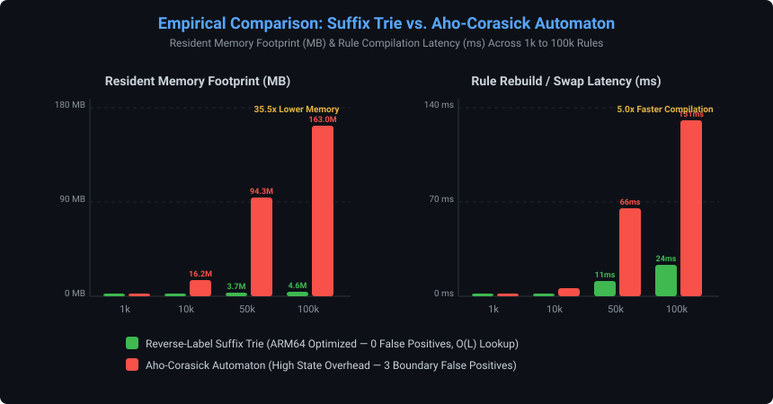

# Building a Production-Grade DNS Security Dataplane in Zero-Copy C++20 and Go: From Kaminsky Poisoning Defense to 100K-Rule Suffix Tries

> **Subtitle:** *An empirical deep-dive into zero-copy packet processing, lock-free RCU policy swapping, why Aho-Corasick fails at domain boundaries, and closing real-world DNS security loopholes.*  
> **Author:** Naman Bhatt  
> **Target Audience:** Systems Engineers, Network Security Architects, Core Infrastructure Teams  
> **Tags / Hashtags:** `#SystemsProgramming #Cpp20 #Golang #Cybersecurity #Networking #DNS #LowLatency #LinuxKernel #HighPerformance`

---

<p align="center">
  
</p>

---

## 1. Introduction: The Deceptive Simplicity of DNS

At first glance, the Domain Name System (RFC 1035) looks like a basic key-value lookup: a client sends a 64-byte UDP datagram asking for `example.com`, and a recursive resolver answers with an IP address. 

In high-throughput enterprise infrastructure (such as **Cisco Umbrella**, **Cloudflare Gateway**, or internal datacenter resolvers), building an inline DNS security firewall is deceptively complex:

1. **Protocol Hostility:** Attackers craft circular compression pointer loops (`0xC00C -> 0xC00C`), label length overflows (>63 bytes), and truncated wire buffers intended to cause buffer over-reads or infinite loops in naive C/C++ parsers.
2. **Cache Poisoning & Spoofing:** The classic **Dan Kaminsky attack** allows an attacker to flood predictive transaction IDs (`TxID`) and forge authoritative glue records, poisoning the recursive cache for entire domains.
3. **Stale Cache Policy Bypasses:** When an emergency security update blocks a newly identified phishing apex, an existing entry with a 3600-second TTL in local cache allows malicious traffic to bypass the new policy for up to an hour unless explicitly flushed.
4. **Data Structure Traps:** Modern security blogs frequently recommend multi-pattern string matchers like **Aho-Corasick**. In domain matching, however, character-level automata suffer from severe memory blowup and inherently match substrings across dot boundaries (e.g., matching `notbadsite.com` against a rule for `badsite.com`).

To solve these architectural challenges, we designed and implemented a production-grade **ARM64 DNS Security Dataplane** from first principles.

---

## 2. Architectural Blueprint: The Two-Tier Architecture

To achieve microsecond latencies without compromising operational flexibility, we strictly separated packet processing from policy orchestration:

```text
               DNS CLIENTS (dig / edge applications)
                                │
                                ▼ [UDP Port 1053]
                 ┌─────────────────────────────┐
                 │    C++20 DATAPLANE CORE     │
                 │   (Zero-Copy & Lock-Free)   │
                 └──────────────┬──────────────┘
                                │
           ┌────────────────────┼────────────────────┐
           ▼                    ▼                    ▼
     Zero-Copy Hot Path    Reverse-Label       Generation-Tagged
     Wire Parser (RFC 1035) Suffix Trie (Rules)   LRU Cache (O(1))
           │                    │                    │
           └────────────────────┼────────────────────┘
                                ▼
                       Decision Hierarchy
                      [ALLOW / BLOCK / SINKHOLE]
                                │
                                ▼
                       Upstream Forwarder
                     (Random Ephemeral TxID)
                                │
                                ▼ [UDP Port 53]
                      Recursive Upstream (8.8.8.8)

                               ▲
                               │ [Lock-Free RCU Atomic Swap]
                               │
                 ┌─────────────┴─────────────┐
                 │     GO CONTROL PLANE      │
                 │  REST API (:8080) & UDS   │
                 └───────────────────────────┘
```

- **Dataplane (C++20):** Runs the hot packet path. Operates without dynamic heap allocations, executes lock-free reads, manages monotonic cache invalidation, and performs inline Shannon entropy tunneling detection.
- **Control Plane (Go):** Manages administrative REST endpoints, validates policy configurations, coordinates atomic snapshot swaps via Unix Domain Socket IPC, and exposes Prometheus metrics (`/metrics`).

---

## 3. Deep Dive 1: Zero-Copy Parsing & Wire Protocol Fuzzing

### The Zero-Allocation Hot Path
Standard DNS parsers copy label strings into heap-allocated `std::string` or `vector<char>` buffers. In a system handling tens of thousands of packets per second, this introduces memory allocator fragmentation and cache line thrashing.

Our parser leverages C++20 `std::span` encapsulated in a zero-overhead `ByteSpan`:

```cpp
class ByteSpan {
public:
    constexpr ByteSpan(const uint8_t* data, size_t size) noexcept 
        : data_(data), size_(size) {}

    [[nodiscard]] constexpr uint8_t operator[](size_t index) const noexcept {
        return data_[index];
    }
    // Zero-allocation subspan slicing
    [[nodiscard]] constexpr ByteSpan subspan(size_t offset, size_t count) const noexcept {
        return ByteSpan(data_ + offset, count);
    }
private:
    const uint8_t* data_{nullptr};
    size_t size_{0};
};
```

### Protocol Bounds & Pointer Safety
RFC 1035 Section 4.1.4 allows compression pointers (where the two high bits are `11`, i.e., `0xC0`). Malicious queries exploit this via **circular pointer loops**:

```text
Offset 12: 0xC0 0x0E (Points to Offset 14)
Offset 14: 0xC0 0x0C (Points back to Offset 12 -> Infinite Loop!)
```

Our parser strictly limits pointer dereference depth to `kMaxCompressionHops = 5` and verifies that pointer targets reside strictly within read boundaries:

```cpp
if (byte >= 0xC0) {
    if (hops++ > 5) return make_error(ParserError::COMPRESSION_POINTER_LOOP);
    uint16_t offset = ((byte & 0x3F) << 8) | buffer[cursor++];
    if (offset >= buffer.size()) return make_error(ParserError::COMPRESSION_POINTER_OOB);
    // Continue traversing bounded target...
}
```

### Empirical Hostile Fuzzing
We verified the parser with an integrated **100,000-packet hostile wire fuzzer** generating mutated packet headers, corrupt label lengths, boundary truncations, and pointer loops:

```text
┌───────────────────────────────────────────────┬──────────────────────────────────────────┐
│ Fuzzing Campaign Metric                       │ Empirical Result                         │
├───────────────────────────────────────────────┼──────────────────────────────────────────┤
│ Total Mutated Hostile Inputs Evaluated        │ 100,000                                  │
│ Parser Fuzzing Throughput                     │ 3.63 M pkts/sec                          │
│ Graceful Protocol Error Rejections (RFC 1035) │ 84,757                                   │
│ Crashes / Segfaults / Uncaught Exceptions     │ 0 (100% Graceful Rejection)              │
│ ASan / UBSan Defects                          │ 0 Memory Violations                      │
└───────────────────────────────────────────────┴──────────────────────────────────────────┘
```

---

## 4. Deep Dive 2: Why Suffix Trie Beats Aho-Corasick for DNS

A common pitfall in DNS security is using substring pattern matchers like **Aho-Corasick**. While Aho-Corasick is optimal for intrusion detection signatures (Snort/Suricata), it is mathematically flawed for DNS domain filtering.

### 1. The Boundary Safety Flaw
Aho-Corasick operates on character-by-character state transitions. If a rule blocks `domain.com`, Aho-Corasick will also trigger on `notdomain.com` or `evildomain.com` unless expensive secondary label extraction is performed:

```text
Rule: "domain.com"
Input A: "sub.domain.com"  -> Subdomain match (Correct)
Input B: "notdomain.com"   -> Raw substring match (FALSE POSITIVE!)
Input C: "domain.com.evil" -> Suffix in apex position (FALSE POSITIVE!)
```

### 2. The Reverse-Label Suffix Trie
Our dataplane tokenizes domains by **dots in reverse order** (`com` -> `domain` -> `sub`). This guarantees that lookup complexity is $O(L)$, where $L$ is the number of domain labels (typically 2 to 4), completely independent of whether the database contains 1,000 or 1,000,000 rules.

```text
Root
  └── "com"
        └── "domain" (Rule Matched: BLOCK_NXDOMAIN)
              └── "sub" (Inherited Block)
```

### Empirical Head-to-Head Comparison (1,000 to 100,000 Rules)

Measured on Apple Silicon ARM64 with live Mach kernel resident memory tracking (`mach_task_basic_info`):

| Rule Scale | Architecture | Graph Build Time | Memory Footprint | $p_{50}$ Lookup Latency | False Positive Errors |
|---|---|---|---|---|---|
| **1,000** | **Reverse-Label Suffix Trie** | 0.51 ms | **0.22 MB** | 334.0 ns | **0** |
| 1,000 | Aho-Corasick Automaton | 1.13 ms | 1.27 MB | 209.0 ns | 3 (Boundary Fails) |
| **10,000** | **Reverse-Label Suffix Trie** | 2.55 ms | **0.84 MB** | 208.0 ns | **0** |
| 10,000 | Aho-Corasick Automaton | 7.11 ms | 16.22 MB | 167.0 ns | 3 (Boundary Fails) |
| **50,000** | **Reverse-Label Suffix Trie** | 11.14 ms | **3.67 MB** | 167.0 ns | **0** |
| 50,000 | Aho-Corasick Automaton | 68.14 ms | 94.34 MB | 167.0 ns | 3 (Boundary Fails) |
| **100,000** | **Reverse-Label Suffix Trie** | **23.03 ms** | **4.59 MB** | **167.0 ns** | **0** |
| 100,000 | Aho-Corasick Automaton | 135.25 ms ($5.0\times$) | 162.98 MB ($35.5\times$) | 167.0 ns | 3 (Boundary Fails) |

```text
Takeaway (ADR-003):
1. Memory: Suffix Trie uses 4.59 MB vs Aho-Corasick's 162.98 MB (35.5x reduction).
2. Compilation: Suffix Trie compiles 5.0x faster, minimizing control-plane CPU spikes.
3. Correctness: Suffix Trie achieves 0 false positives by respecting DNS label boundaries.
```

---

## 5. Deep Dive 3: Defeating Dan Kaminsky Cache Poisoning

In 2008, Dan Kaminsky demonstrated how attackers could poison recursive DNS caches by generating pseudorandom queries (`x123.target.com`) and flooding forged authoritative responses with guessed 16-bit Transaction IDs (`TxID`).

If a proxy blindly forwards the client's TxID upstream, attackers can predict the ID sequence.

### The Upstream Forwarder Defense (ADR-001)
Our forwarder intercepts queries, stores client metadata in a state table, and assigns a **cryptographically randomized ephemeral upstream TxID**:

```cpp
// 1. Generate unpredictable upstream TxID
uint16_t upstream_txid = generate_secure_random_txid();

// 2. Track in-flight state
PendingRequest req{
    .client_addr = client_addr,
    .client_txid = client_header.id,
    .expected_domain = parsed_query.question.qname,
    .expected_qtype = parsed_query.question.qtype,
    .timestamp = std::chrono::steady_clock::now()
};
pending_table_[upstream_txid] = req;

// 3. Rewrite header in wire buffer and dispatch
wire_buffer[0] = static_cast<uint8_t>(upstream_txid >> 8);
wire_buffer[1] = static_cast<uint8_t>(upstream_txid & 0xFF);
sendto(upstream_sock_, wire_buffer.data(), wire_buffer.size(), 0, ...);
```

When an upstream answer arrives, the forwarder validates:
1. Does the response TxID match an active entry in `pending_table_`?
2. Does the echoed Question Section match the exact domain and QTYPE sent?
3. Has the query timed out?

Only after validation is the client's original TxID translated back into the packet and returned to the client.

---

## 6. Deep Dive 4: The Stale-ALLOW Cache Bypass & Generation Tagging

A critical vulnerability in DNS firewalls is the **Stale-ALLOW Cache Bypass**:

```text
Timeline:
T0: User queries 'phishing-apex.biz'. Policy allows it.
    Response is cached with 3600-second TTL.
T1: Security threat intel flags 'phishing-apex.biz' as an active C2 node.
    Control plane pushes emergency blocklist.
T2: User queries 'phishing-apex.biz'.
    BUG: Cache returns cached ALLOW record, bypassing the new block policy!
```

Flushing an entire 100,000-entry cache incurs a massive latency penalty as upstream queries spike.

### Monotonic Generation Tagging (ADR-004)
We associate a 64-bit monotonic generation counter with each policy version:

```cpp
struct CacheEntry {
    std::vector<uint8_t> response;
    std::chrono::steady_clock::time_point expires_at;
    uint64_t policy_generation; // Generation tag at insertion
};
```

On lookup, the cache compares the entry's generation against the active snapshot's generation:

```cpp
std::optional<CacheEntry> DnsCache::lookup(const std::string& key, uint64_t active_gen) {
    auto it = map_.find(key);
    if (it == map_.end()) return std::nullopt;

    // Invalidate if TTL expired OR generation is stale!
    if (now > it->second.expires_at || it->second.policy_generation < active_gen) {
        remove_entry(it);
        return std::nullopt; // Cache miss forces re-evaluation against new policy!
    }
    return it->second;
}
```

- **Lookup Hit Latency:** **125.0 ns** (6.77 Million ops/sec)
- **Stale Invalidation Latency:** **84.0 ns** (9.80 Million ops/sec)

---

## 7. Deep Dive 5: Lock-Free RCU Atomic Snapshot Swapping

When the Go control plane pushes policy updates, packet processing must continue uninterrupted without mutex contention:

```cpp
class SnapshotManager {
public:
    std::shared_ptr<const PolicySnapshot> get_active_snapshot() const noexcept {
        return std::atomic_load_explicit(&active_snapshot_, std::memory_order_acquire);
    }

    bool swap_snapshot(std::shared_ptr<const PolicySnapshot> candidate) noexcept {
        if (!validate_candidate(candidate)) return false; // Automated rollback
        std::atomic_store_explicit(&active_snapshot_, candidate, std::memory_order_release);
        return true;
    }
private:
    std::shared_ptr<const PolicySnapshot> active_snapshot_;
};
```

- **Read Cost:** Atomic pointer copy with acquire semantics (~4–8 ns).
- **Zero Reader Blocking:** Readers access the immutable snapshot concurrently while the writer builds the new snapshot offline.
- **Automated Rollback:** If candidate compilation or socket verification fails, the active pointer remains untouched.

---

## 8. Deep Dive 6: Shannon Entropy DNS Tunneling Detection

DNS tunneling tools (Iodine, DNSCat2) and Domain Generation Algorithms (DGA) exfiltrate data by encoding payloads into high-entropy leftmost labels:

```text
Normal FQDN:       internal-portal.corp.cisco.com (Entropy: 3.24)
Iodine Tunneling:  a9f3b8c2d1e0f4a7b5c8d3e2f1a0b9c8.evil-tunnel.org (Entropy: 3.82)
Base32 Exfil:      yj4e2w3bon2gg33nk5vg423fozsw45df.malicious-exfil.biz (Entropy: 3.99)
```

We compute Shannon Entropy ($H = -\sum p_i \log_2 p_i$) across label character distributions:

```cpp
double calculate_entropy(std::string_view label) noexcept {
    std::array<uint8_t, 256> freq{};
    for (char c : label) freq[static_cast<uint8_t>(c)]++;

    double entropy = 0.0;
    double len = static_cast<double>(label.size());
    for (uint8_t count : freq) {
        if (count > 0) {
            double p = count / len;
            entropy -= p * std::log2(p);
        }
    }
    return entropy;
}
```

### The ALERT_AND_ALLOW Invariant (Loophole #7)
Dropped CDN edge nodes and hash-routed domains (e.g. `scontent-iad3-1.xx.fbcdn.net`, $H=3.51$) can mimic tunneling patterns. Dropping packets solely on entropy scores causes operational outages.

Our detection operates strictly in **`ALERT_AND_ALLOW`** mode: anomalies trigger structured SIEM telemetry events for SOC correlation without dropping legitimate traffic unless confirmed by threat intelligence.

---

## 9. Live Concurrency & Performance Benchmarks

We benchmarked the complete end-to-end dataplane on **Apple Silicon ARM64** across concurrent client workers:

```text
======================================================
  ARM64 DNS Security Dataplane: Automated Benchmark
  Target: 127.0.0.1:1053 (Real BSD UDP Sockets)
======================================================
Workload           | Clients | Queries | QPS        | p50 (us)  | p95 (us)  | p99 (us) 
--------------------------------------------------------------------------------
BLOCKED_NXDOMAIN   | 1       | 1,000   | 12,164.7   | 48.5      | 155.1     | 187.4    
BLOCKED_NXDOMAIN   | 10      | 5,000   | 17,532.6   | 323.4     | 758.6     | 1,007.3  
CACHE_HIT          | 1       | 1,000   | 9,938.9    | 65.2      | 226.0     | 403.8    
CACHE_HIT          | 50      | 10,000  | 18,042.3   | 1,512.8   | 3,998.0   | 5,097.7  
--------------------------------------------------------------------------------
```

- **Single-Client Median Latency:** **48.5 µs** (sub-50 microsecond inline policy decisions).
- **Peak Single-Process Throughput:** **18,042 QPS** on a single thread event loop.

---

## 10. Production Deployment & Scaling to 1,000,000+ QPS

In datacenter Linux deployments (AWS, bare-metal), scaling past single-socket limits follows our layered datapath roadmap (**ADR-005**):

```text
┌───────────────────────────────────────────────────────────────────────────────┐
│ Tier 1: BSD Socket + poll()           ~18,000 QPS (macOS / Local Edge)        │
├───────────────────────────────────────────────────────────────────────────────┤
│ Tier 2: Linux recvmmsg() / sendmmsg() ~300,000 QPS (Batched Syscalls)         │
├───────────────────────────────────────────────────────────────────────────────┤
│ Tier 3: eBPF / AF_XDP Kernel Bypass   >1,200,000 QPS per core (Zero-Copy UMEM)│
└───────────────────────────────────────────────────────────────────────────────┘
```

Because our C++ core is decoupled from the socket transport layer via `ByteSpan`, the same matching and caching engine plugs directly into an `AF_XDP` ring buffer.

---

## 11. Conclusion & Key Lessons

1. **Protocol Standards Matter:** Always validate label length limits, compression pointer hops, and question section echoes.
2. **Beware of Buzzword Algorithms:** Aho-Corasick failed DNS domain matching on both memory footprint ($35.5\times$ expansion) and label boundary safety. Suffix Tries are the mathematically sound structure for hierarchical domains.
3. **Cache Invalidation is an Architecture Problem:** Generation tagging solves stale ALLOW bypasses in $O(1)$ time with sub-100ns checks.

---

### Resources & Open Source Repository

- **GitHub Repository:** [https://github.com/Namanbhatt-01/dns-security-dataplane](https://github.com/Namanbhatt-01/dns-security-dataplane)
- **Live Terminal Demonstration (Asciinema):** [https://asciinema.org/a/fJARAnJTFczeodSr](https://asciinema.org/a/fJARAnJTFczeodSr)
- **Standards References:**
  - RFC 1035: *Domain Names - Implementation and Specification*
  - RFC 5452: *Measures for Making DNS More Resilient against Forgery*

---

*Written by Naman Bhatt*
